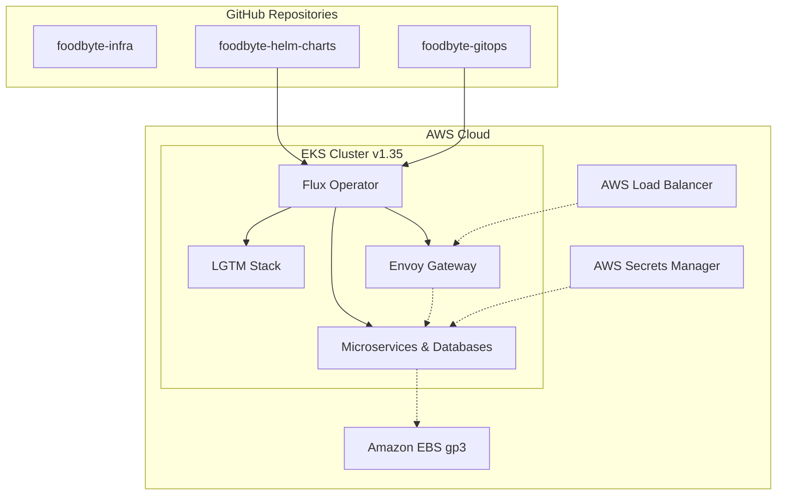

# FoodByte GitOps

This is the central orchestration repository for the FoodByte cluster. It acts as the **Single Source of Truth** and the entry point for the entire platform ecosystem, managing everything from core infrastructure to advanced observability.

## 🌐 Repository Ecosystem
To understand the full architecture, refer to the sibling repositories:
- [**foodbyte-infra**](https://github.com/ansuman-satapathy/foodbyte-infra): The "Hardware" Layer. Terraform modules for VPC, EKS, and IAM.
- [**foodbyte-helm-charts**](https://github.com/ansuman-satapathy/foodbyte-helm-charts): The "Blueprint" Layer. Logic library of Helm charts for every microservice.
- [**foodbyte-gitops**](https://github.com/ansuman-satapathy/foodbyte-gitops): (Current Repo) The "Release" Layer. Pins SHAs and manages live environment state.

## 🏗️ Architecture & GitOps Flow



## 📸 Project Screenshots

### 1. The GitOps Command Center

*Real-time reconciliation of the 3-wave synchronization pipeline.*

### 2. Cluster Observability

*Live metrics and resource utilization across the 3-node EKS cluster.*

### 3. Log Aggregation

*Structured log streaming from microservices via Grafana Alloy and Loki.*

### 4. Enterprise Hardware

*EKS Node Groups and EBS Persistent Volumes provisioned via Terraform.*

---

## 🏗️ Architecture
This repository utilizes the **Flux Operator (v0.50.0)** to manage the cluster via a 3-Wave synchronization pipeline:

- **Wave 1: Operators**: External Secrets Operator (ESO), Envoy Gateway (v1.8.0), and the LGTM Monitoring Stack.
- **Wave 2: Configs**: AWS Secrets mapping, StorageClasses, and Gateway API routing rules.
- **Wave 3: Apps**: 5 Microservices (FastAPI/React) and 4 self-hosted databases.

## 📊 Observability Stack (PGL)
The cluster is equipped with a professional 2026-standard monitoring pipeline:
- **Loki (v6.55.0)**: Centralized log aggregation with EBS persistence.
- **Grafana (v85.2.2)**: Advanced visualization for metrics and logs.
- **Prometheus**: Cluster-wide metrics scraping and alerting.
---

## 🚀 How to run (Step-by-Step)

Follow these steps exactly to rebuild the environment from scratch.

### 1. Provision the Hardware
```bash
cd ~/Documents/Tech/Ops/foodbyte/foodbyte-infra/terraform/live/dev
terraform apply -auto-approve
```

### 2. Establish Cluster Context
```bash
aws eks update-kubeconfig --region us-east-1 --name foodbyte-dev-cluster
```

### 3. Install API Gateway CRDs
EKS 1.35 requires the Gateway API definitions to be installed manually:
```bash
kubectl apply -f https://github.com/kubernetes-sigs/gateway-api/releases/download/v1.1.0/standard-install.yaml
```

### 4. Configure Production Security
Create the 5 mandatory secrets in AWS Secrets Manager:
```bash
aws secretsmanager create-secret --name foodbyte/prod/jwt-secret --secret-string "YOUR_SECRET"
aws secretsmanager create-secret --name foodbyte/prod/postgres-password --secret-string "YOUR_PASS"
aws secretsmanager create-secret --name foodbyte/prod/mongo-password --secret-string "YOUR_PASS"
aws secretsmanager create-secret --name foodbyte/prod/rabbitmq-password --secret-string "YOUR_PASS"
aws secretsmanager create-secret --name foodbyte/prod/redis-password --secret-string "YOUR_PASS"
```

### 5. Install the Flux Operator CLI
```bash
curl -sL https://github.com/controlplaneio/flux-operator/releases/download/v0.50.0/flux-operator_0.50.0_linux_amd64.tar.gz | tar xz
sudo mv flux-operator /usr/local/bin/
```

### 6. Run flux install
```bash
cd ~/Documents/Tech/Ops/foodbyte/foodbyte-gitops
flux-operator install -f clusters/production/flux-system/instance.yaml
```

---

## 🔍 Verification & Dashboards

### Monitor the Rollout
```bash
# Watch the pods turn Green
kubectl get kustomization -n flux-system -w

# Verify all pods are running
kubectl get pods -A | grep -v kube-system
```

### Access Flux Dashboard
```bash
kubectl port-forward -n flux-system svc/flux-operator 9080:9080
# Open http://localhost:9080
```

### Access Grafana (Metrics & Logs)
```bash
kubectl port-forward -n monitoring svc/kube-prometheus-stack-grafana 3000:80
# Open http://localhost:3000 (User: admin, Pass: ChooseYourPass123!)
```

### Find Public Entry Point
```bash
kubectl get gateway foodbyte-gateway -o jsonpath='{.status.addresses[0].value}'
```
