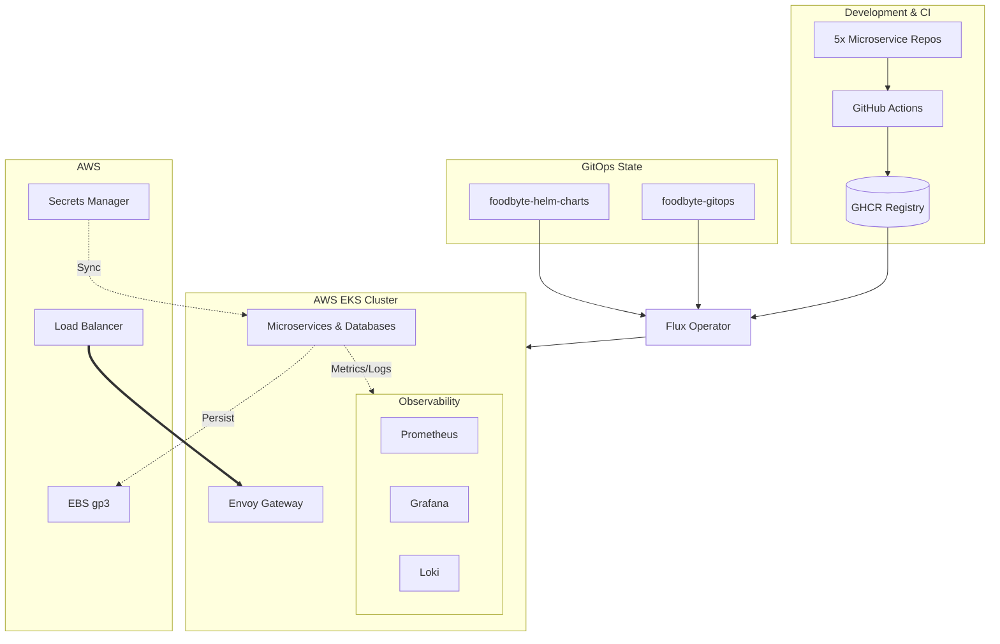
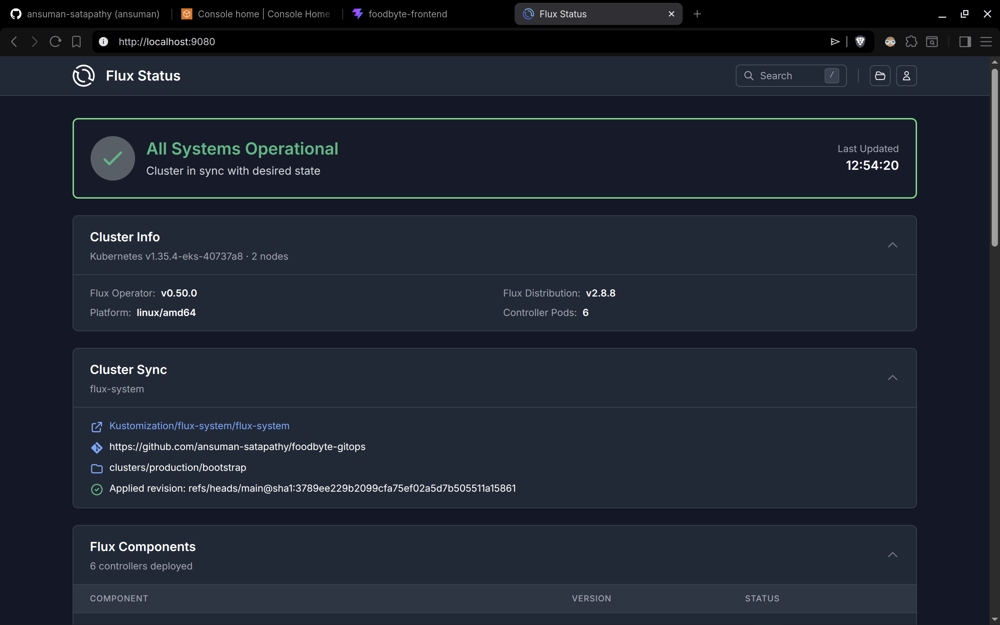
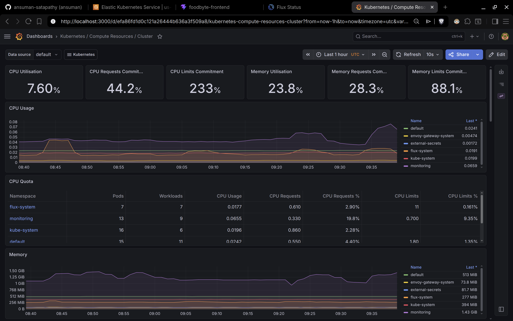
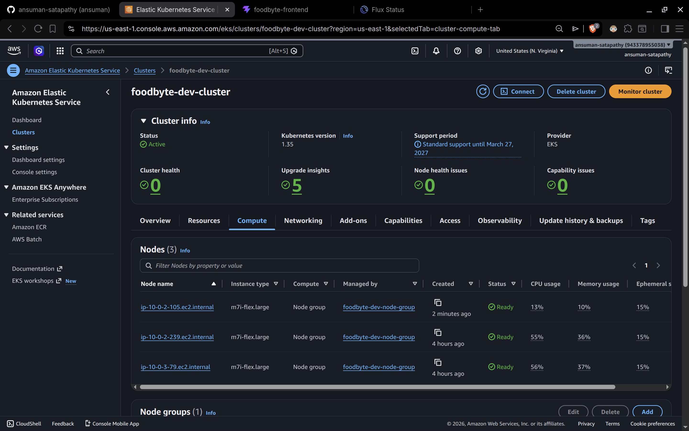

# FoodByte GitOps

This is the repo that runs FoodByte in production. Flux watches it and reconciles the cluster within 60 seconds of any commit. Everything from ingress routing to secrets mapping to observability is declared here.

## Repositories

The platform lives across 8 repos:

**Infrastructure**
| Repo | What it does |
|---|---|
| [foodbyte-infra](https://github.com/ansuman-satapathy/foodbyte-infra) | Terraform for VPC, EKS, and IAM |
| [foodbyte-helm-charts](https://github.com/ansuman-satapathy/foodbyte-helm-charts) | Helm chart templates for all 5 services |
| [foodbyte-gitops](https://github.com/ansuman-satapathy/foodbyte-gitops) | This repo. Pins versions and owns cluster state |

**Services** (each has its own CI pipeline, Dockerfile, and GHCR image)
- [user-service](https://github.com/ansuman-satapathy/foodbyte-user-service) / [order-service](https://github.com/ansuman-satapathy/foodbyte-order-service) / [restaurant-service](https://github.com/ansuman-satapathy/foodbyte-restaurant-service) / [notification-service](https://github.com/ansuman-satapathy/foodbyte-notification-service) / [frontend](https://github.com/ansuman-satapathy/foodbyte-frontend)

## How it all fits together



## Sync order

Flux applies everything in three waves so dependencies are always ready before the things that need them:

```
Wave 1   External Secrets Operator, Envoy Gateway, LGTM monitoring stack
Wave 2   AWS secrets mapping, StorageClasses, Gateway routing rules
Wave 3   5 microservices + 4 self-hosted databases
```

Each wave waits for the previous one to be fully healthy. This was a necessary fix after running into Flux sync deadlocks where ExternalSecrets were being applied before the operator existed.

## Observability

Full LGTM stack running inside the cluster:
- **Prometheus** for cluster-wide metrics scraping and alerting
- **Loki** for centralized log aggregation with EBS persistence
- **Grafana** for dashboards across both metrics and logs

## Screenshots

### Flux dashboard


### Grafana


### EKS nodes


---

## Getting Started

### 1. Clone the Entire Platform
To set up the complete 8-repo ecosystem locally, use the master setup script:

```bash
curl -sL https://raw.githubusercontent.com/ansuman-satapathy/foodbyte-gitops/main/setup.sh | bash
```
*This script creates a `foodbyte-platform/` directory and handles cloning/pulling for all repositories.*

### 2. Bootstrapping from scratch

### 1. Provision infrastructure
```bash
cd foodbyte-infra/terraform/live/dev
terraform init
terraform apply
```

### 2. Get cluster credentials
```bash
aws eks update-kubeconfig --region us-east-1 --name foodbyte-dev-cluster
```

### 3. Install Gateway API CRDs
```bash
kubectl apply -f https://github.com/kubernetes-sigs/gateway-api/releases/download/v1.1.0/standard-install.yaml
```

### 4. Create secrets in AWS Secrets Manager
```bash
aws secretsmanager create-secret --name foodbyte/prod/jwt-secret --secret-string "YOUR_SECRET"
aws secretsmanager create-secret --name foodbyte/prod/postgres-password --secret-string "YOUR_PASS"
aws secretsmanager create-secret --name foodbyte/prod/mongo-password --secret-string "YOUR_PASS"
aws secretsmanager create-secret --name foodbyte/prod/rabbitmq-password --secret-string "YOUR_PASS"
aws secretsmanager create-secret --name foodbyte/prod/redis-password --secret-string "YOUR_PASS"
```

### 5. Install Flux Operator
```bash
curl -sL https://github.com/controlplaneio/flux-operator/releases/download/v0.50.0/flux-operator_0.50.0_linux_amd64.tar.gz | tar xz
sudo mv flux-operator /usr/local/bin/
```

### 6. Bootstrap
```bash
cd foodbyte-gitops
flux-operator install -f clusters/production/flux-system/instance.yaml
```

Flux reconciles everything automatically from here.

---

## Verification

```bash
# Watch waves reconcile
kubectl get kustomization -n flux-system -w

# Check all pods are healthy
kubectl get pods -A | grep -v kube-system
```

### Access dashboards locally

```bash
# Flux
kubectl port-forward -n flux-system svc/flux-operator 9080:9080
# http://localhost:9080

# Grafana
kubectl port-forward -n monitoring svc/kube-prometheus-stack-grafana 3000:80
# http://localhost:3000  (admin / your-password)
```

### Find the public endpoint
```bash
kubectl get gateway foodbyte-gateway -o jsonpath='{.status.addresses[0].value}'
```

---

## Teardown

Run these in order to avoid orphaned AWS resources:

```bash
# Remove Kubernetes-managed AWS resources first (LBs, EBS volumes)
kubectl delete gateway --all
kubectl delete pvc --all

# Wait ~60 seconds for AWS to clean up

# Destroy infrastructure
cd foodbyte-infra/terraform/live/dev
terraform destroy
```
